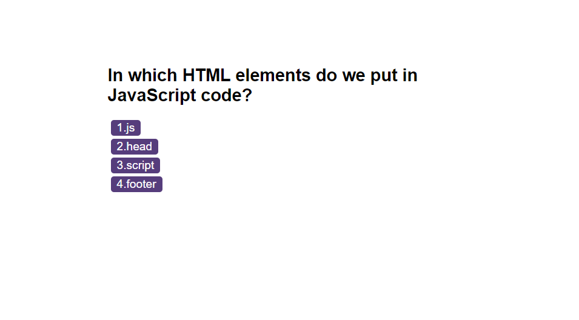

## Description
This is the Coding Quiz Challenge game application.

# Deployed link
https://jameshii26.github.io/Coding_Quiz_Challenge/

# Repo link source code
https://github.com/jameshii26/Coding_Quiz_Challenge

## Screen shot

# Table content

## Usage
This is a Coding Quiz Challenge Game application, a very fun & interesting game to test your coding knowledge. 

How to use it?

 1. Click the Purple "Start Quiz" button to start the game or click "View Highscores" to see the Leaderboard.
 2. The timer will start, read the question carefully & choose the correct answer.
 3. You will get immediately feedback of your choice with "Correct!" or "Wrong!"
 4. The game will end if the time runs out or you have answered all the quiz questions.
 6. Type in your name & see if you have hit the highest score.
 7. Click "Clear Highscore" to clear the Leaderboard list or click "Go Back" to the game.
  
# Credits
N/A

# License
MIT. Please refer to the LICENSE in the repo.